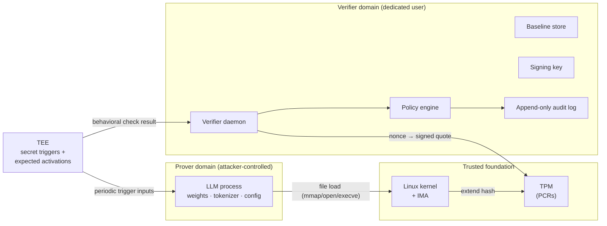

# LLMGuard: An Integrity Attestation Framework for Large Language Models

**Aayush Rai** · Advisor: **Dr. Eugene Vasserman**
Department of Computer Science, Kansas State University · Capstone, Spring 2026

<p>
  <a href="LLMGuard-Paper.pdf"><b>📄 Paper</b></a> &nbsp;·&nbsp;
  <a href="LLMGuard-Presentation.pdf"><b>🎤 Presentation</b></a> &nbsp;·&nbsp;
  <a href="LLMGuard-Poster.pdf"><b>🖼️ Poster</b></a>
</p>

---

## TL;DR

Once a large language model is loaded into a process, it is usually treated as trusted. But a model is just data: weights, a tokenizer, and configuration on disk that become tensors in memory. Anyone who controls the process can tamper with any of them, and nothing downstream will notice.

**LLMGuard** is a layered attestation design that detects this tampering on commodity Linux hardware. It combines two primitives from the literature:

| Layer | Mechanism | Protects | Covers |
|---|---|---|---|
| **Load-time** | TPM + Linux Integrity Measurement Architecture (IMA) | Model and tokenizer files as they are loaded | A1, A2 |
| **Runtime** | TEE-protected behavioral attestation (AttestLLM-style) | The live, in-memory model while it serves requests | A3, partially A4 |

Neither layer is enough by itself. IMA stops tracking the model once its bytes are in memory, which is a time-of-check-to-time-of-use (TOCTOU) gap. Behavioral attestation leaves a window before its first check. Used together, each layer covers the other's blind spot.

> This is a **design contribution**. The deliverables are the threat model, a comparative analysis of five attestation approaches, and the layered architecture. Implementation and empirical evaluation are future work.

---

## Deliverables

| Artifact | File | Notes |
|---|---|---|
| Final paper | [`LLMGuard-Paper.pdf`](LLMGuard-Paper.pdf) | 10 pages, IEEE conference format. **The authoritative description of the design.** |
| Final presentation | [`LLMGuard-Presentation.pdf`](LLMGuard-Presentation.pdf) | 18 slides, presented May 6, 2026 |
| Poster | [`LLMGuard-Poster.pdf`](LLMGuard-Poster.pdf) | 60" × 45" landscape |

---

## Threat Model

The adversary is a **userspace attacker who fully owns the LLM process**, so the prover and the adversary are the same principal. The attacker can modify any file its account owns, read and write its own memory through `/proc/self/mem` and `ptrace`, use `LD_PRELOAD`, monkey-patch the Python interpreter, and control all of the process's I/O.

The attacker is bounded by the **kernel and the TPM**. It cannot become root or the verifier user, cannot touch the verifier's files or memory, cannot forge the verifier's signatures, and cannot alter IMA measurements or PCRs.

### Attacks in scope

| ID | Attack | Target |
|---|---|---|
| **A1** | At-rest tampering: modify or replace weight files before load | File system |
| **A2** | Tokenizer tampering: alter how inputs are parsed without touching weights | File system |
| **A3** | In-memory tampering: modify the loaded model after load | Process memory |
| **A4** | Runtime parameter manipulation: temperature, top-p, system prompt, length limits | Inference call site |
| **A5** | Execution-state tampering: modify internal computation during inference | Execution path. *Acknowledged, deferred to future work.* |

**Out of scope:** kernel-level attackers, side-channel and microarchitectural attacks, physical attacks, supply-chain backdoors (a provenance problem), and network-level tampering with attestation reports.

---

## Approaches Considered

Five candidate approaches from the literature were evaluated against the threat model (Table I in the paper):

| Approach | A1 | A2 | A3 | A4 | A5 | Hardware | Used |
|---|:-:|:-:|:-:|:-:|:-:|:-:|:-:|
| TPM + IMA | ✓ | ✓ | × | × | × | TPM | ✓ |
| AttestLLM-style behavioral attestation | ✓ | ∼ | ✓ | ∼ | ∼ | TEE | ✓ |
| Runtime segmented attestation (PracAttest) | ∼ | × | ✓ | × | × | TEE | × |
| Software-based attestation (SWATT-style) | ∼ | ∼ | ∼ | × | × | — | × |
| Zero-knowledge ML (zkLLM) | ✓ | ✓ | ✓ | ✓ | ✓ | — | × |

<sub>✓ covered · ∼ partial · × not covered</sub>

- **zkML** covers everything in theory. It was rejected because generating proofs takes minutes per token at LLM scale.
- **Software-based attestation** was rejected because its assumptions of predictable timing and a hidden attacker don't hold on a multi-process server where the attacker legitimately owns the process.
- **Segmented attestation** is kept as a possible software-only fallback. It lacks the cryptographic strength of the TEE approach.

---

## Architecture

LLMGuard runs on a single Linux machine that is split into three trust domains:



**Attestation flow.** Each round has three stages:

1. **Load-time measurement.** When the LLM process loads a file, IMA hashes it with SHA-256, extends the hash into a TPM PCR, and appends an entry to the kernel measurement log. All of this happens in kernel space, out of the attacker's reach.
2. **Evidence collection.** The verifier asks the TPM for a PCR quote bound to a fresh nonce, collects the measurement log, and collects the latest behavioral check result from the TEE.
3. **Evaluation.** The verifier replays the log against the signed PCR value and compares the measurements with the baseline. It also confirms that the latest behavioral check matched the expected activations. The outcome is signed and appended to the audit log. On failure, the system can alert, halt the model, or trigger an out-of-band response.

The behavioral checks run on their own schedule, independent of verifier requests. An attacker who never answers the verifier is still caught.

The TEE can be **hardware-backed** (Intel SGX, AMD SEV-SNP, ARM TrustZone) or **software-backed** (a hypervisor-based isolation domain). This choice trades assurance against deployability.

---

## Limitations

1. **Out-of-scope adversaries.** A kernel-level, side-channel, or physical attacker defeats the guarantees.
2. **A5 is not addressed.** Execution-state tampering during inference remains open.
3. **TEE trade-offs.** Hardware TEEs have documented attacks (Foreshadow, ZombieLoad, Plundervolt, VoltPillager, …). Software TEEs protect only against userspace adversaries.
4. **No empirical validation.** Detection rates, false positives, latency, and overhead have not been measured.

## Future Work

- Implement the verifier daemon, the IMA integration, and the TEE-resident behavioral attestation, then evaluate them.
- Build stronger software-TEE constructions, such as Komodo- or SANCTUARY-style microkernels and confidential VMs.
- Cover A5 through deeper TEE-resident instrumentation, or through zkML once it becomes practical.
- Move from attestation to continuous **auditing**, where evidence is pushed to an external log.
- Support multi-model and multi-tenant deployments.

---

## Repository Structure

```
llm-integrity-attestation/
├── README.md
├── LLMGuard-Paper.pdf              # Final paper (authoritative)
├── LLMGuard-Presentation.pdf       # Final presentation
├── LLMGuard-Poster.pdf             # Poster
└── docs/                           # Design-process notes that fed into the paper
    ├── 00-glossary.md              # Roles, components, and terms
    ├── 01-threat-model.md          # Extended threat-model notes (→ paper §III)
    ├── 03-defense-spec.md          # Five-approach analysis (→ paper §V)
    └── archive/                    # Superseded earlier designs
        ├── original-adversary-model.md
        ├── architecture-original.md
        └── architecture-original.svg
```

The files under `docs/` are the working notes kept as a record of how the design developed. Where they differ from the paper, the paper takes precedence. The `docs/archive/` folder holds earlier iterations that were replaced, including a first design based on a non-root adversary and an AppArmor/eBPF confinement architecture. The `v0-old-design` tag marks the repository before the redesign.

## Key References

1. M. Ammar, A. Caulfield, I. De Oliveira Nunes. *SoK: Integrity, Attestation, and Auditing of Program Execution.* IEEE S&P 2025.
2. M. Schneider, R. J. Masti, S. Shinde, S. Capkun, R. Perez. *SoK: Hardware-Supported Trusted Execution Environments.* arXiv:2205.12742, 2022.
3. M. Li, Y. Yang, G. Chen, M. Yan, Y. Zhang. *SoK: Understanding Design Choices and Pitfalls of Trusted Execution Environments.* ASIA CCS 2024.
4. R. Sailer, X. Zhang, T. Jaeger, L. van Doorn. *Design and Implementation of a TCG-Based Integrity Measurement Architecture.* USENIX Security 2004.
5. R. Zhang et al. *AttestLLM: Efficient Attestation Framework for Billion-Scale On-Device LLMs.* DAC 2026, arXiv:2509.06326.

The full bibliography is in the paper.

## Citation

```bibtex
@misc{rai2026llmguard,
  author       = {Rai, Aayush},
  title        = {{LLMGuard}: An Integrity Attestation Framework for Large Language Models},
  howpublished = {Capstone project, Department of Computer Science, Kansas State University},
  year         = {2026},
  note         = {Advisor: Eugene Vasserman},
  url          = {https://github.com/aayush24rai/llm-integrity-attestation}
}
```

## Acknowledgments

Thanks to Dr. Eugene Vasserman for advising this project and for selecting the literature that shaped the design. As noted in the paper, AI-assisted tools (Anthropic Claude and OpenAI ChatGPT) were used for diagram generation and editorial help. All design decisions, technical content, and final wording are the author's own.
